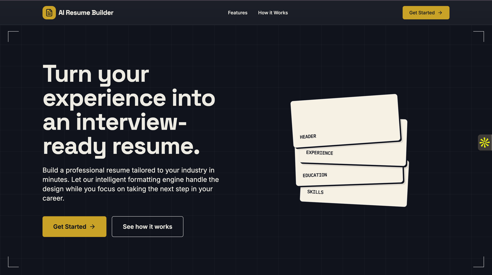

<div align="center">
  

  <h1>AI Resume Builder</h1>
  <p>Turn your experience into an interview-ready resume.</p>

  <a href="https://github.com/pran-ekaiva006/AI-resume_builder">
    
  </a>
  <a href="https://ai-resume-builder-6-o5vo.onrender.com">
    
  </a>
  <a href="https://github.com/pran-ekaiva006/AI-resume_builder/blob/main/LICENSE">
    
  </a>
</div>

---

## 🎯 About The Project

**AI Resume Builder** is a full-stack web application that simplifies the resume creation process. It leverages AI to analyze your inputs and generate professional, ATS-friendly content tailored to your specific industry and job role. 

Let the intelligent formatting engine handle the design and layout while you focus on taking the next step in your career.

## ✨ Features

- **AI-Powered Content Generation**: Automatically generate compelling summaries and experience bullet points using Google's Gemini 2.5 Flash model.
- **Dynamic 3D UI Elements**: Engaging, interactive 3D landing page components built with React Three Fiber and Framer Motion.
- **Secure Authentication**: Robust authentication system combining custom JWT (HttpOnly cookies) and Google OAuth.
- **Live Preview & PDF Export**: See changes to your resume in real-time and export a clean, formatted PDF instantly.
- **Public Sharing**: Generate a unique, shareable URL for your resume to send to recruiters.

## 🛠️ Tech Stack

**Frontend**
- **Framework**: React 18 (Vite)
- **Styling & UI**: Tailwind CSS, Radix UI
- **Animations & 3D**: Framer Motion, Three.js (`@react-three/fiber`, `@react-three/drei`)
- **Routing**: React Router DOM

**Backend**
- **Runtime**: Node.js
- **Framework**: Express.js
- **Database**: MongoDB (Mongoose)
- **Auth**: `jsonwebtoken`, `google-auth-library`, `bcryptjs`
- **AI Integration**: `@google/genai` (Server), `@google/generative-ai` (Client)

**Deployment**
- **Frontend**: Netlify
- **Backend API**: Render

## 🏗️ Architecture

This repository uses a decoupled Client-Server architecture:
1. **Client (`/client`)**: A Vite-powered React SPA that handles UI rendering, 3D graphics, and client-side routing.
2. **Server (`/server`)**: A Node/Express REST API that manages MongoDB read/writes, JWT session cookies, and secure proxying of prompts to the Google Gemini API.

*Note: The production build is configured via a `postinstall` script to serve the compiled Vite frontend statically from the Node server.*

## 🚀 Getting Started

### Prerequisites
- **Node.js** (v18 or higher recommended)
- **MongoDB** (Local instance or MongoDB Atlas cluster)
- **Gemini API Key** (Get one from [Google AI Studio](https://aistudio.google.com/))
- **Google OAuth Client ID** (For Google Sign-In)

### Installation

1. **Clone the repository:**
   ```bash
   git clone https://github.com/pran-ekaiva006/AI-resume_builder.git
   cd AI-resume_builder
   ```

2. **Install Client Dependencies:**
   ```bash
   cd client
   npm install
   ```

3. **Install Server Dependencies:**
   ```bash
   cd ../server
   npm install
   ```

### Environment Variables

You need to set up `.env` files in **both** the `client` and `server` directories. Copy the provided `.env.example` files:

#### Client (`client/.env`)
| Variable | Description |
|----------|-------------|
| `VITE_BACKEND_URL` | The URL of your Express API (e.g., `http://localhost:5001`) |
| `VITE_BASE_URL` | The URL of your frontend (e.g., `http://localhost:5173`) |
| `VITE_GOOGLE_CLIENT_ID` | Your Google OAuth Client ID for frontend sign-in |

#### Server (`server/.env`)
| Variable | Description |
|----------|-------------|
| `MONGO_URI` | Your MongoDB connection string |
| `PORT` | The port the Express server runs on (default: `5001`) |
| `GEMINI_API_KEY` | Your Google Gemini API Key |
| `NODE_ENV` | `development` or `production` |
| `CLIENT_URL` | Allowed CORS origin (e.g., `http://localhost:5173`) |
| `RENDER_EXTERNAL_URL` | (Optional) Production URL for deployment |
| `GOOGLE_CLIENT_ID` | Your Google OAuth Client ID for backend verification |
| `ACCESS_TOKEN_SECRET` | Secret key for signing JWT access tokens |
| `REFRESH_TOKEN_SECRET`| Secret key for signing JWT refresh tokens |
| `SMTP_*` | (Optional) SMTP credentials for email services |

### Running Locally

Open two separate terminal instances:

**Terminal 1 (Frontend):**
```bash
cd client
npm run dev
```

**Terminal 2 (Backend):**
```bash
cd server
npm run dev
```
*(The backend runs on `http://localhost:5001` and the frontend runs on `http://localhost:5173`)*

## 📂 Folder Structure

```text
AI-resume_builder/
├── client/                 # Frontend React Application
│   ├── public/             # Static assets (images, logos)
│   ├── service/            # Global Axios API configuration
│   └── src/
│       ├── assets/         # Home page & banner assets
│       ├── auth/           # Authentication pages (Sign In, Sign Up, Reset)
│       ├── components/     # Reusable UI & custom components
│       ├── context/        # React Context (Auth, ResumeInfo)
│       ├── dashboard/      # Dashboard and Resume Editor interface
│       └── my-resume/      # Public/Live preview routes
├── server/                 # Backend Express API
│   ├── controllers/        # Route logic (Auth, Resumes)
│   ├── middlewares/        # JWT & rate-limiting middleware
│   ├── models/             # Mongoose schemas (Resume, User)
│   └── routes/             # Express API routes (aiRoutes, authRoutes, resumeRoutes)
└── README.md
```

## 🤝 Contributing

Contributions, issues, and feature requests are welcome!
1. Fork the Project
2. Create your Feature Branch (`git checkout -b feature/AmazingFeature`)
3. Commit your Changes (`git commit -m 'Add some AmazingFeature'`)
4. Push to the Branch (`git push origin feature/AmazingFeature`)
5. Open a Pull Request

## 📜 License

This project is licensed under the MIT License - see the [LICENSE](LICENSE) file for details.

## 👤 Author

**Pranjal Kumar Verma**
- GitHub: [@pran-ekaiva006](https://github.com/pran-ekaiva006)
